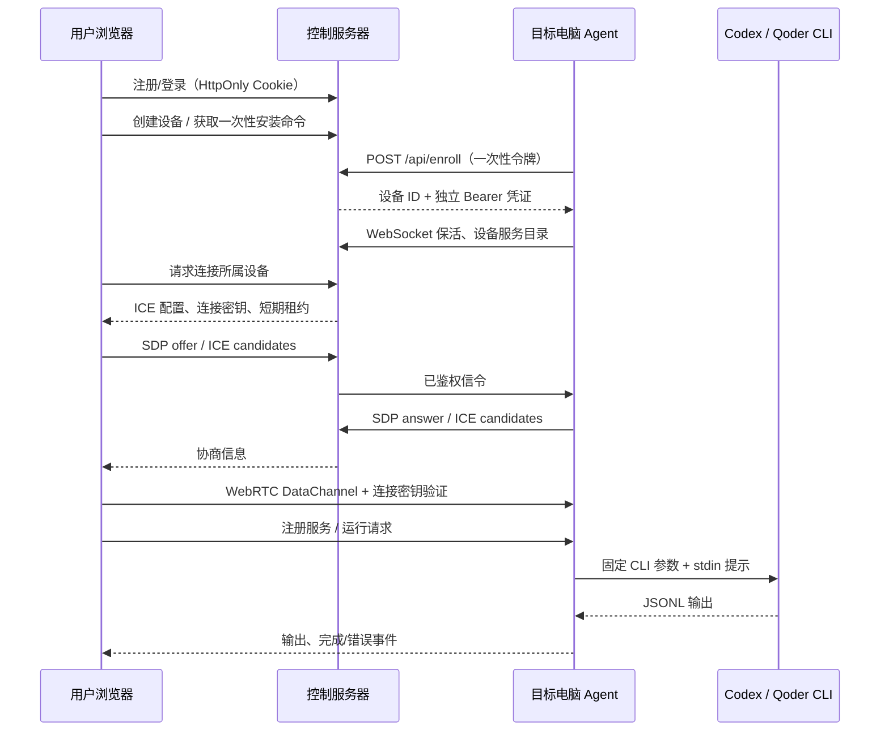

# 架构与协议



WebRTC 通过 ICE 挑选可达路径；必要时 TURN 只中继 DTLS 密文。应用服务器没有任务执行或输出转发 API。信令服务器能看到 SDP、IP 候选及连接密钥，仍是可信控制平面。

## HTTP

| 路由 | 身份 | 行为 |
| --- | --- | --- |
| `POST /api/register` | 无 | 用户名和密码，成功后写登录 Cookie |
| `POST /api/login` | 无 | 登录 |
| `POST /api/logout` | Cookie | 删除当前会话并关闭它创建的直连会话 |
| `GET /api/me` | Cookie | 当前用户 ID 和过期时间 |
| `GET /api/agents` | Cookie | 仅所属设备及在线状态 |
| `POST /api/agents` | Cookie | `{name}` → 设备、两种安装命令 |
| `DELETE /api/agents/{id}` | Cookie | 校验归属、撤销和断开 |
| `POST /api/enroll` | 一次性令牌 | `{token,os,arch}` → `{id,name,credential}` |
| `GET /api/agent/connect?id=...` | Bearer | Agent WebSocket |
| `GET /api/agents/{id}/signal` | Cookie + Origin | 浏览器信令 WebSocket |

POST 要求 `application/json`，禁止跨来源写请求及跨来源 WebSocket；Cookie 使用 HttpOnly / SameSite=Strict，HTTPS 时 Secure。凭证只存 SHA-256 哈希；用户密码使用 bcrypt cost 12。

## 信令

消息格式在 `internal/protocol/protocol.go`。

- Agent 每 20 秒发 `heartbeat` 和服务目录；服务器回复保活确认。
- 浏览器先收到 `ready`：`peerId`、随机 `secret`、`expiresAt`、`iceServers`。
- 浏览器只可发一次 `offer`，然后发送候选。服务器自行填入 peer ID / secret，忽略客户端伪造的路由字段。
- Agent 回 `answer` / `candidate`，服务器仅转发给此设备所属连接。
- 浏览器每 20 秒 `ping`，服务端 `pong`。退出、撤销、掉线时服务端向 Agent 发 `close`。
- 服务端每个读取周期校验会话与设备状态；Agent 强制执行租约到期，信令断开时销毁所有 Peer。

浏览器 / Agent 均允许在 SDP 到达前暂存候选；服务端限制消息大小、候选数量及每设备连接数。设备重新上线替换旧控制连接时也会关闭旧浏览器会话。

## DataChannel

唯一通道名 `remote-agent`，有序可靠传输。首条请求必须为：

```json
{"id":"request-id","type":"authenticate","secret":"per-connection-secret"}
```

认证成功后返回设备的服务列表、检测到的 CLI 和本机授权策略。

| 请求类型 | 字段 | 结果 |
| --- | --- | --- |
| `services.list` | 无 | `services, providers, allowedRoots, allowWrite` |
| `services.add` | `service: {name,provider,workspace}` | 规范化服务，随机 ID |
| `services.remove` | `serviceId` | 成功；有运行任务时拒绝 |
| `run` | `serviceId,prompt` | `started` → 多个 `output` → `done` |
| `cancel` | `runId` | 仅能取消当前 Peer 创建的匹配任务 |

普通应答 `{id,type:"result",data}`，错误 `{id,type:"error",error}`。输出为 `{id,type:"output",data:{stream:"stdout",text:"..."}}`，另有 stderr。任务完成使用 `{id,type:"done",data:{ok:true}}`，失败时附 `error`。

运行器只从本机检测结果挑选固定命令，不接受任意 executable、shell 参数或环境变量。提示通过 stdin 传递；浏览器文本不会拼到 shell 命令。Windows 包装 `.cmd/.ps1` 时只引用本机命令路径和固定参数。取消使用 Windows 进程树终止 / Unix 进程组终止。

## 文件与部署边界

- `cmd/server`：HTTP 入口、配置、关停。
- `internal/server`：鉴权、设备目录、信令 Hub、安装脚本。
- `internal/store`：bbolt 事务及凭证哈希。
- `cmd/agent`：安装绑定、运行、状态、自启动命令。
- `internal/agent`：设备配置、Pion、服务管理、提供方适配器、进程生命周期。
- `web`：内嵌静态前端，没有构建链或远程 CDN 依赖。
- `tools/build`：可复现参数的交叉编译及 SHA-256 文件生成；仍需独立签名供应链才能提供发布者真实性保证。

下一阶段可在保持 DataChannel 协议稳定的基础上增加原生会话恢复、细粒度审批、可恢复任务、设备密钥指纹校验、PostgreSQL/Redis 多节点路由和自动升级。
